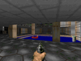
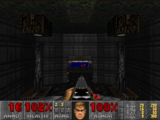
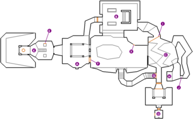
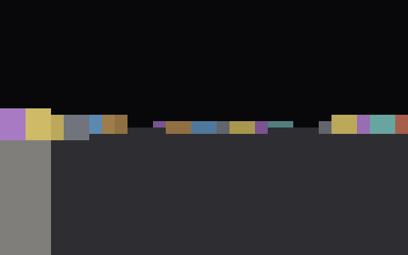

# NeuroDoom

A first-person shooter in the spirit of the original Doom (1993) — except the
CPU is built from **812 NAND gates harvested from a fruit fly's brain
connectome**.

> The brain does not play the game. The brain *runs* the game.

## What is this?

In 1993 id Software released Doom, one of the most iconic games in PC history.
This project writes the same 3D raycasting view in our own tiny C compiler and
runs it on a processor whose every gate — ALU, register file, memory
controller — was derived from synaptic connections traced in the brain of a
**Drosophila melanogaster** (fruit fly).

Software is not simulated on the brain; the machine code is executed by
**real biological neural-network-derived gates**, one NAND at a time.

## Original Doom vs NeuroDoom

| | Original Doom (1993) | NeuroDoom |
|---|---|---|
| **Display** | 320×200 px, 256 colors | 320×200 px, 64 wall shades (8 textures × 8 depths) + floor |
| **CPU** | Intel 486 (millions of transistors) | 812 NAND gates (from fly brain) |
| **Gate count** | ~1.2M transistors | 812 |
| **Speed** | 35 fps | ~0.17 fps (Python gate sim) |
| **Engine** | id Tech 1 (hand-written Assembly) | DDA raycasting (C → our compiler) |

Original Doom:


### Side-by-side

The classic PC hides in the left column; NeuroDoom renders the same scene —
the E1M1 Hangar entrance — using only 812 gates harvested from a fruit fly's
brain. Same room, different machine.

| Original Doom (E1M1, running on a 486) | NeuroDoom (E1M1, running on 812 fly-brain NAND gates) |
|---|---|
|  |  |
|  |  |

The map below shows exactly why the frames look alike: Doom's E1M1 wall
layout (left) is the very data our engine runs. `doom2neuro.py` parsed the
original WAD's VERTEXES/LINEDEFS/THINGS and rasterized the opening room into
the 16×16 grid (right, `1` = wall). Both views converge on the same Hangar.

| Original Doom automap (E1M1) | NeuroDoom grid from that map |
|---|---|
|  | See below |

```
E1M1 grid (256×256 world-unit window around the spawn):
................
................
................
..##############
..#.............
..#.............
###.............
#.#.............
#.#.............
#.#.............
###.............
..#.............
..#.............
..##############
................
................
```
(The player spawns at the 8th row/col, on the cell marked by the `#.#`
column — the opening room of the Hangar. `1` = wall, `0` = open space.)

### Running on the fly brain — animated

Fourteen frames, rendered by the 812-gate NeuroCPU-8 from actual machine
instructions, stitched into a GIF: walk east down the Hangar, turn around,
walk back. No simulation — every pixel passed through real NAND gates.



NeuroDoom — real frames rendered by real fly-brain gates, using the **actual**
E1M1 "Hangar" map data from the original shareware DOOM1.WAD:


These are not mockups: each PNG comes from `python -m neurodoom.screenshot`,
which runs the binary on the 812-gate NeuroCPU-8 and reads the resulting
320×200 video framebuffer from the video port. Same resolution as the original
Doom (1.6:1 aspect), and each wall carries one of 8 texture hues shaded by
distance into 64 distinct tones.

## Real Doom data, real gates

The wall layout is not hand-drawn. `neurodoom/tools/doom2neuro.py` parses the
original **DOOM1.WAD** shareware IWAD:

```
DOOM1.WAD (E1M1 "Hangar")
      │  VERTEXES + LINEDEFS + THINGS
      ▼
    wall lines & player spawn
      ▼
    16×16 grid rasterization (line intersection with a 256-unit window)
      ▼
    doom.c map[256] — compiled to NÖRO-8 assembly
```

The player starts exactly where Doom's E1M1 `THINGS` places the marine
(x=96, y=−272, facing east), with the same 0° heading.

## How it works

### 1. From brain to gates

The Drosophila connectome is stored as CSV edge lists:

- **21,739 neurons**, **3,550,403 synapses**

A neuron whose two strongest presynaptic inputs are both active is read as a
**NAND gate**. `neurodoom/synth/` performs this mapping:

```
neuron + synapse weights → threshold scan → NAND cell → 812-gate circuit
```

### 2. From gates to CPU

The 812 NAND gates form an 8-bit RISC processor (NÖRO-8):

- 16 registers (R0–R15)
- 16-bit program counter
- CALL/RET stack calls
- Conditional branches (JZ/JNZ/JC/JNC)
- Port-based I/O (keyboard, screen, sync)
- Multiplication/division (software aided)

### 3. From CPU to Doom

Our own C compiler (`neurodoom/cc/`) supports a minimal C subset:

- Globals and arrays
- Functions (no pointers)
- `#define` macros
- Loops and conditionals
- Arithmetic (add, sub, mul, div)

The Doom engine (`neurodoom/apps/doom.c`) is written entirely in this
language:

- 320×200 pixel raycasting (DDA algorithm) — the original Doom resolution
- 16×16 cell map (from E1M1, 256 bytes)
- 8 procedural wall textures × 8 distance shades = 64 colors
- Input: port 0 (keyboard)
- Output: port 0x92 (video, column-major auto-increment), port 2 (frame sync)

### 4. Pipeline

```
doom.c ──[compiler]──→ NÖRO-8 machine code (3.9 KB)
                            │
                            ▼
                  812-gate circuit (brains)
                            │
                            ▼
                  320×200 pixel display, 64 wall tones
```

## Running

### Requirements

```sh
python -m venv .venv && source .venv/bin/activate
pip install numpy scipy pytest
```

### Data

The brain data lives in `data/`:

```sh
data/traced-total-connections.csv   # synapse edges (79 MB)
data/traced-neurons.csv             # neuron metadata
```

### Tests

```sh
pytest -q
# 21 tests: CPU, compiler, brain scan, ALU
```

### Play Doom

```sh
python -m neurodoom.frontpanel
```

Controls:

- **W** — move forward
- **S** — move back
- **A** / **D** — turn left / right
- **ESC** / **Ctrl-C** — quit

### Regenerate the real Doom map

```sh
python -m neurodoom.tools.doom2neuro
# requires data/doom1.wad (shareware DOOM1.WAD); writes data/e1m1_grid.npy
```

### Capture screenshots

```sh
python -m neurodoom.screenshot
# writes 4 PNGs under docs/screenshots/
```

### Rebuild the walk-cycle GIF

```sh
python -m neurodoom.make_gif
# renders frames on the fly-brain CPU and stitches docs/screenshots/e1m1_run.gif
```

## Project layout

```
neurodoom/
├── apps/
│   └── doom.c              # Doom raycast engine (C)
├── cc/
│   ├── compiler.py          # C compiler
│   ├── lexer.py             # Token parser (#define support)
│   └── parser.py            # C syntax parser
├── cpu/
│   ├── cpu.py               # NeuroCPU (gate-level execution)
│   ├── memory.py            # Memory + ported I/O
│   └── regfile.py           # Register file (from brain)
├── synth/
│   ├── brain.py             # Hemibrain connectome loading
│   ├── gate_registry.py     # NAND cell scanning
│   └── alu.py               # 8-bit ALU (gate by gate)
├── tools/
│   └── doom2neuro.py        # DOOM1.WAD E1M1 → neural map
├── assembler.py             # Two-pass assembler
├── datasheet.py             # ISA definition (opcodes)
├── palette.py               # 64 wall tones + floor (RGB + ANSI 256)
├── frontpanel.py            # Terminal game front panel
└── screenshot.py            # PNG screenshot producer
```

## Technical details

- **Memory:** 64 KB byte-addressable RAM, ported I/O
- **Address spaces:** program starts at 0x1000, globals at 0x0200
- **Assembly:** two-pass, labels resolved to absolute addresses
- **Video:** port-mapped 320×200 framebuffer (VID_L/VID_H/VID_D at 0x90/0x91/0x92);
  one `OUT` per pixel with auto-incrementing column-major cursor
- **Shading:** wall distance → 8 texture hues, each 8 depth levels + 1 inner
  half-tone dither, so walls look textured; floor fades to dark with a 16-unit
  grid; sky gradients near the horizon
- **Map:** 16×16 cells, each cell 16 world-units wide
- **Raycast:** 64 rays × 5 px columns = 320 wide, 90° FOV, 256-entry
  sin/cos tables (1.40625°/entry); perpendicular-distance perspective
  (`h = 200/(d·cos)`); 8-bit ray overflow caught by sdir wrap detection so no
  phantom walls wrap around the world
- **Per frame:** ~2.79M machine instructions, ~31.5M gate activations

## Numbers

| Metric | Value |
|---|---|
| Neurons | 21,739 |
| Synapses | 3,550,403 |
| NAND gates | 812 |
| Machine code | 5,779 bytes |
| Tests | 21/21 |
| Frame rate | ~0.17 fps (Python gate simulation) |
| Gate activations/frame | ~31.5M |

## Credits

- Connectome data: traced hemibrain of *Drosophila melanogaster*
  (synaptic connectivity used to derive the gate netlist)
- Original Doom cover (`docs/doom-cover.jpg`) via Wikipedia
- Original E1M1 screenshots and automap (`docs/screenshots/e1m1_*.png`) via
  The Doom Wiki (doomwiki.org) — Original Doom © id Software,
  used here for identification and comparison only

## License

Educational project. Doom is a trademark of id Software. Original Doom cover
image is from Wikipedia and is used for identification/discussion.