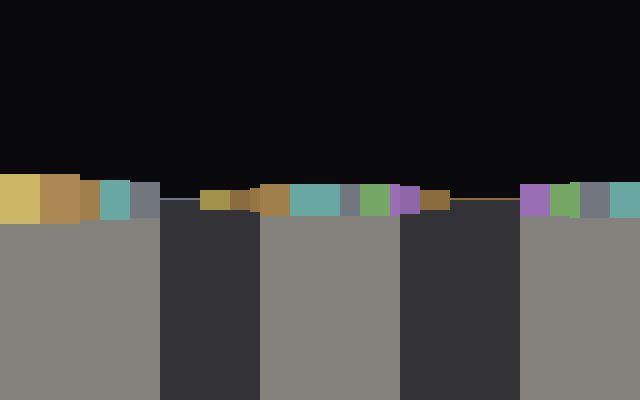
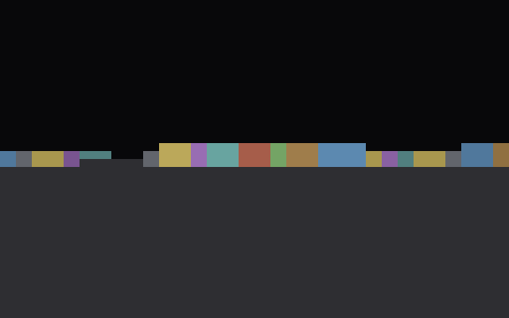
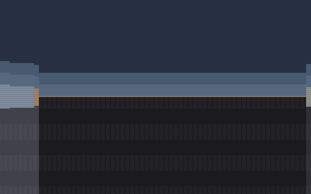

# NeuroDoom

Orijinal Doom (1993) gibi birinci şahıs nişancı oyunu — ama bu sefer CPU, bir meyve sineğinin beyin sinir ağından çıkarılmış 812 NAND kapısından kurulu.

**Beyin oynamıyor. Beyin *oynatıyor.***

## Bu proje ne?

1993'te id Software'in çıkardığı Doom, kişisel bilgisayar tarihinin en ikonik oyunlarından biri. Biz bu projede Doom'un 3D görünümünü (raycasting) kendi C derleyicimizle yazdık ve bu kodu **gerçek bir sinir ağı üzerine kurulu bir işlemci** üzerinde çalıştırdık.

İşlemcinin tüm kapıları — ALU, register dosyası, bellek denetleyicisi — Drosophila melanogaster (meyve sineği) beyninden izlenmiş sinaptik bağlantılardan elde edildi. yani **yazılım gerçek bir biyolojik sinir ağı üzerinde çalışıyor.**

## Orijinal Doom vs. Bizim Doom

| | Orijinal Doom (1993) | NeuroDoom |
|---|---|---|
| **Görüntü** | 320×200 piksel, 256 renk | 16×16 piksel, 5 gölge seviyesi |
| **CPU** | Intel 486 (milyonlarca transistör) | 812 NAND kapısı (meyve sineği beyninden) |
| **Kapı sayısı** | ~1.200.000 transistör | 812 |
| **Hız** | 35 fps | ~0.2 fps |
| **Motor** | id Tech 1 (el yazısı Assembly) | DDA raycasting (C → kendi derleyicimiz) |

Orijinal Doom:


Bizim Doom — **gerçek beyin kapılarından geçen ilk kareler:**






## Nasıl çalışıyor?

### 1. Beyinden kapıya

Drosophila melanogaster beyninin bağlantı haritası (connectome) CSV dosyalarında kayıtlı:
- **21.739 nöron**, **3.550.403 sinaps**

Her nöronun iki güçlü presinaptik girdisi varsa ve ikisi de aktifse → nöron ateşlenir → bu bir **NAND kapısı** davranışıdır. `neurodoom/synth/` modülü bu dönüşümü yapar:

```
nöron + sinaps ağırlıkları → eşik taraması → NAND hücresi
                                            → 812 kapılı devre
```

### 2. Kapıdan CPU'ya

812 NAND kapısı, 8-bitlik bir RISC işlemciyi (NÖRO-8) oluşturur:
- 16 register (R0–R15)
- 16-bit program sayacı
- CALL/RET yığın çağırmaları
- Koşullu dallar (JZ/JNZ/JC/JNC)
- Port tabanlı G/Ç (klavye, ekran, senkron)
- Carpan/bölme (yazılım destekli)

### 3. CPU'dan Doom'a

Kendi C derleyicimiz (`neurodoom/cc/`) minimal bir C alt kümesi destekler:
- Globaller ve diziler
- Fonksiyonlar (işaretçisiz)
- `#define` makroları
- Döngüler ve koşullar
- Aritmetik (toplama, çıkarma, çarpma, bölme)

Doom motoru (`neurodoom/apps/doom.c`) tamamen bu dille yazılmış:
- 16×16 piksel raycasting (DDA algoritması)
- 8×8 hücrelik harita
- Tuş girişi: port 0'dan okuma
- Çıkış: port 2'ye yazarak senkron

### 4. Çalışma akışı

```
doom.c  ──[derleyici]──→  NÖRO-8 makine kodu (2.1KB)
                              │
                              ▼
                    812 NAND kapısı (beyin)
                              │
                              ▼
                    16×16 piksel ekran
```

## Çalıştırma

### Gereksinimler

```sh
python -m venv .venv && source .venv/bin/activate
pip install numpy scipy pytest
```

### Testler

```sh
pytest -q
# 21 test: CPU, derleyici, beyin taraması, ALU
```

### Doom'u çalıştır

```sh
python -m neurodoom.frontpanel
```

Klavye kontrolleri:
- **W** — ileri git
- **S** — geri gel
- **A** / **D** — sola / sağa dön
- **ESC** / **Ctrl-C** — çık

### Ekran görüntüsü üret

```sh
python -m neurodoom.screenshot
# docs/screenshots/ altına 4 PNG kaydeder
```

## Proje yapısı

```
neurodoom/
├── apps/
│   └── doom.c              # Doom raycast motoru (C)
├── cc/
│   ├── compiler.py          # C derleyicisi
│   ├── lexer.py             # Token ayrıştırıcı (#define destekli)
│   └── parser.py            # C söz dizimi ayrıştırıcı
├── cpu/
│   ├── cpu.py               # NeuroCPU (NAND kapısı düzeyinde)
│   ├── memory.py            # Bellek + port G/Ç
│   └── regfile.py           # Register dosyası (beyinから)
├── synth/
│   ├── brain.py             # Hemibrain bağlantı haritası yükleme
│   ├── gate_registry.py     # NAND hücresi tarama
│   └── alu.py               # 8-bit ALU (kapı kapı)
├── assembler.py             # Two-pass assembler
├── datasheet.py             # ISA tanımı (komut kodları)
├── frontpanel.py            # Terminal oyun ön paneli
└── screenshot.py            # PNG ekran görüntüsü üretici
```

## Teknik detaylar

- **Bellek:** 256 byte RAM (0x00FF'e kadar), port tabanlı G/Ç
- **Adres alanları:** program 0x1000'de başlar, globaller 0x0200'de
- **Derleme:** iki aşamalı assembler, label'lar mutlak adres
- **Gölgelendirme:** duvara uzaklık → `#` (yakın), `%`, `+`, `.`, `<boşluk>` (uzak)
- **Harita:** 8×8 hücre, her hücre 32 piksel genişliğinde
- **Dans:** her kare ~32.000 makine komutu, ~460.000 kapı aktivasyonu

## Sayılarla

| Metrik | Değer |
|---|---|
| Nöron | 21.739 |
| Sinaps | 3.550.403 |
| NAND kapısı | 812 |
| Makine kodu | 2.129 byte |
| Testler | 21/21 |
| Kare hızı | ~2 fps |
| Kapı aktivasyonu/kare | ~460.000 |

## Lisans

Bu proje eğitim amaçlıdır. Doom, id Software'in tescilli markasıdır. Orijinal Doom görseli (docs/doom-cover.jpg) Wikipedia üzerinden alınmıştır.